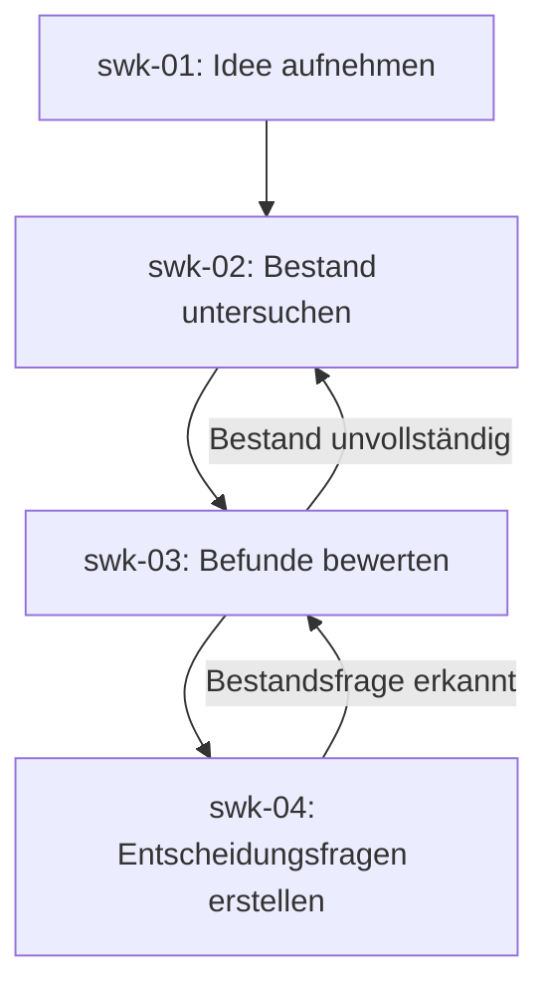

# Skizzwerk-Prozess

## Zweck

Diese Datei definiert die Reihenfolge der skizzwerk-Phasen und die
Voraussetzungen für den Übergang zwischen ihnen.

Die inhaltliche Bearbeitung einer Phase richtet sich nach der jeweiligen
Datei unter `phases/`. Für Nachweise, Dokumentstatus und Qualitätsgrenzen
gelten zusätzlich die Dateien unter `rules/`.

## Prozessübersicht

## Allgemeine Regeln für Phasenübergänge

- Eine Phase beginnt erst, wenn ihre in der jeweiligen Phasendatei genannten
  Eingaben und Eintrittsvoraussetzungen erfüllt sind.
- Eine Phase gilt erst als abgeschlossen, wenn ihre Abschlusskriterien erfüllt
  sind.
- Das Ergebnis einer Phase muss die zugehörige Qualitätsgrenze in
  `rules/quality-gates.md` erfüllen.
- Der Status `review` erlaubt noch keinen regulären Übergang in die nächste
  Phase.
- Ein regulärer Übergang in die nächste Phase erfolgt erst, wenn das
  erforderliche Ergebnisdokument den Status `accepted` besitzt.
- `accepted` darf nur nach ausdrücklicher menschlicher Bestätigung gesetzt
  werden.
- Ist eine Eintrittsvoraussetzung nicht erfüllt, beginnt die nachfolgende Phase
  nicht.
- Fehlende Voraussetzungen werden mit konkreter Begründung dokumentiert.
- Fehlende Informationen dürfen nicht durch Annahmen ersetzt werden.
- Eine spätere Phase darf Ergebnisse einer früheren Phase nicht
  stillschweigend verändern.

## Übergang von swk-01 zu swk-02

Der Übergang zu `swk-02` erfolgt, wenn:

- die projektspezifische `idea.md` vollständig bearbeitet wurde,
- die Qualitätsgrenze für `swk-01` erfüllt ist,
- die projektspezifische `idea.md` den Status `accepted` besitzt.

`swk-02` verwendet die akzeptierte `idea.md` als verbindliche Grundlage für
die Abgrenzung der Bestandsuntersuchung.

## Übergang von swk-02 zu swk-03

Der Übergang zu `swk-03` erfolgt, wenn:

- die projektspezifische `inventory.md` vollständig bearbeitet wurde,
- die Qualitätsgrenze für `swk-02` erfüllt ist,
- die projektspezifische `inventory.md` den Status `accepted` besitzt.

`swk-03` bewertet ausschließlich Befunde, Quellen, Konflikte, unbekannte
Sachverhalte und Untersuchungsgrenzen, die in der akzeptierten
`inventory.md` dokumentiert sind.

## Rückkehr von swk-03 zu swk-02

`swk-03` kehrt zu `swk-02` zurück, wenn die Bestandsgrundlage für eine
nachvollziehbare Bewertung unvollständig ist und eine weitere
Bestandsuntersuchung erforderlich ist.

Eine Rückkehr erfordert die Dokumentation:

- des fehlenden oder unzureichend untersuchten Sachverhalts,
- der betroffenen Befunde,
- der Bedeutung für die Bewertung,
- der zusätzlich benötigten Untersuchung,
- der voraussichtlich verfügbaren Quellen oder Prüfwege.

Ein mit `UNKNOWN` gekennzeichneter Sachverhalt führt nicht automatisch zur
Rückkehr. Die Rückkehr erfolgt nur, wenn der Sachverhalt für die Bewertung
wesentlich ist und durch eine weitere Bestandsuntersuchung geklärt oder
genauer abgegrenzt werden kann.

Kann ein wesentlicher Sachverhalt nicht durch weitere Bestandsuntersuchung
geklärt werden, wird er nicht durch eine Annahme ersetzt. Seine weitere
Behandlung richtet sich nach den dafür vorgesehenen späteren Phasen.

## Anforderungsklärungen in swk-03

Erkennt `swk-03` eine notwendige Präzisierung oder Bestätigung einer bereits
vorhandenen Aussage der Projektidee, wird sie nach
`rules/clarifications.md` als `clr-nnn` in der projektspezifischen
`clarifications.md` dokumentiert und mit dem Ideengeber geklärt.

Eine normale Anforderungsklärung ergänzt die akzeptierte `idea.md` um eine
nachvollziehbare Aussage des Ideengebers, ohne die akzeptierte `idea.md`
selbst zu verändern. Nach der Antwort werden die betroffenen Teile von
`assessment.md` aktualisiert und die Qualitätsgrenze von `swk-03` erneut
geprüft.

Widerspricht die Antwort der akzeptierten `idea.md`, verändert sie den
Projektgegenstand materiell oder führt sie eine neue, bisher nicht angelegte
Projektanforderung ein, ist sie keine bloße Präzisierung. Dann wird der
betroffene frühere Prozessstand bestimmt und nach dem folgenden
Änderungslebenszyklus erneut bearbeitet.

Anforderungsklärungen dürfen nicht als Ersatz für Wissenslücken, Annahmen,
Entscheidungsbedarfe oder Entscheidungen verwendet werden.

## Aktualisierung eines akzeptierten Phasenergebnisses

Muss ein bereits akzeptiertes Phasenergebnis ergänzt oder geändert werden:

- bleibt die bisher akzeptierte Fassung nachvollziehbar erhalten,
- wird eine neue Fassung als zu prüfende Arbeitsfassung erstellt,
- durchläuft die neue Fassung erneut die Qualitätsgrenze der betroffenen
  Phase,
- benötigt die neue Fassung erneut eine ausdrückliche menschliche Bestätigung,
- erhält die ersetzte Fassung erst bei Annahme der neuen Fassung den Status
  `superseded`,
- müssen nachfolgende Ergebnisse erneut geprüft werden, wenn ihre Grundlage
  verändert wurde.

## Maschinenlesbare Phasenergebnisse

Wenn eine Phase eine strukturierte Quelldatei und eine daraus erzeugte
Darstellung festlegt, ist ausschließlich die strukturierte Quelldatei zu
bearbeiten.

Die erzeugte Darstellung darf nicht manuell geändert werden. Vor einem
Statuswechsel zu `review` müssen die strukturierte Datei validiert und die
Darstellung neu erzeugt werden. Eine fehlgeschlagene Validierung verhindert
den Statuswechsel.

## Übergang von swk-03 zu swk-04

Der Übergang zu `swk-04` erfolgt, wenn:

- die Bewertung der Befunde entsprechend `phases/swk-03-assessment.md`
  abgeschlossen ist,
- keine für die Bewertung notwendige und durch weitere Bestandsuntersuchung
  klärbare Lücke besteht,
- alle in `assessment.md` dokumentierten späteren Entscheidungsbedarfe klar
  von reinen Wissenslücken getrennt sind,
- alle für den Abschluss erforderlichen Anforderungsklärungen beantwortet und
  nach `rules/clarifications.md` in `clarifications.md` dokumentiert sowie in
  der Bewertung berücksichtigt sind,
- die Qualitätsgrenze für `swk-03` erfüllt ist,
- die projektspezifische `assessment.md` den Status `accepted` besitzt.

`swk-04` übernimmt die in `assessment.md` dokumentierten Entscheidungsbedarfe
und strukturiert sie als Entscheidungsfragen. Die Bewertung selbst wird in
`swk-04` nicht erweitert oder wiederholt.

## Rückkehr aus swk-04

Erkennt `swk-04`, dass eine vermeintliche Entscheidungsfrage tatsächlich nur
wegen fehlender Bestandsinformation offen ist, darf diese Lücke nicht durch
eine Entscheidung oder Annahme ersetzt werden.

Ist die fehlende Information durch Bestandsuntersuchung klärbar, wird der
Rückkehrbedarf dokumentiert und die Bearbeitung führt über `swk-03` zurück zu
`swk-02`. Nach einer Änderung des akzeptierten Bestands müssen die davon
betroffenen Ergebnisse von `swk-03` erneut geprüft werden.

Ist die fehlende Information keine Bestandsfrage, bleibt sie als offene
Klärung dokumentiert.
